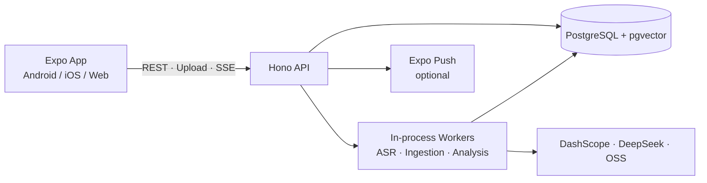

<div align="center">
  
  <h1>EchoWave</h1>
  <p>把音频、业务分析与团队知识库连接起来的开源自托管工作台。</p>

[English](./README.en.md) · 简体中文

[](./LICENSE)


</div>

EchoWave 面向需要从访谈、销售通话、会议等音频中沉淀结构化洞察的团队。它提供中文和英文界面的 Expo 客户端、自托管 API、PostgreSQL/pgvector 知识库、版本化转写与人工确认、情绪/角色识别、业务分析以及可追溯的 AI 执行记录。

> [!IMPORTANT]
> EchoWave 当前是 `v0.1` 开发预览版：使用固定开发租户，尚未提供真实账号、权限控制和公网部署所需的完整安全边界。请仅部署在可信局域网，不要把 API 端口直接暴露到公网。仓库暂未发布可直接安装的正式 APK，现阶段需要从源码构建客户端。

[快速开始](#快速开始) · [当前能力](#当前能力) · [架构](#系统如何工作) · [项目边界](#当前边界) · [Future](#future) · [完整文档](./docs/README.md) · [贡献指南](./CONTRIBUTING.md)

## 为什么是 EchoWave

- **从音频到报告**：上传音频，完成 ASR、说话人复核、转写确认、角色/情绪识别和业务分析。
- **结果可校正、可追溯**：原始转写、确认版本和后续分析分层保存；重试、取消、恢复和供应商调用均保留审计事实。
- **知识库增强**：将 Markdown、Word 和表格文档写入 pgvector，通过带引用的检索回答支撑业务分析。
- **自托管优先**：服务端、数据库、音频与 Credential 边界由部署者掌控，App 在运行时连接指定服务器。
- **跨平台与双语**：同一 Expo 工程覆盖 Android、iOS 和 Web，App 与分析输出支持简体中文和英文。

## 当前能力

| 能力       | 已实现内容                                                                      |
| ---------- | ------------------------------------------------------------------------------- |
| 工作空间   | 分组、知识库、数据源、关联关系、音频上传、软归档与起步模板                      |
| 音频处理   | DashScope 文件转写、Silero VAD、说话人分段、转写确认、重试/取消/恢复            |
| 后续分析   | 说话人复核、业务角色、声学/文本情绪、LangGraph 销售复盘与自定义关注点           |
| 知识库     | Markdown、DOCX、XLSX 文档解析，DashScope embedding、pgvector 检索与可信引用回答 |
| 自动化     | 立即或定时批次、断点恢复、SSE 实时状态、应用内状态与可选 Expo Push              |
| 配置与审计 | Provider/Credential revision、能力绑定、任务配置快照和脱敏 AI 执行报告          |
| 客户端     | Android/iOS/Web、运行时服务器选择、新手引导、中文/英文界面与分析语言            |

## 系统如何工作



`packages/contracts` 中的 Zod schema 是 API 与客户端之间的共享边界。PostgreSQL 是业务事实的唯一权威来源；Redis 目前只有配置契约，没有参与队列、缓存或业务持久化。更完整的模块、数据流和安全边界见[架构说明](./docs/architecture.md)。

## 快速开始

### 前置条件

- 源码开发：Node.js `24.x`、pnpm `11.3.0`、PostgreSQL `15+`、pgvector `0.8.0+`、FFmpeg
- 自托管 Server：Docker Desktop 或 Docker Engine + Compose
- 原生 App：Android Studio/Android 设备，或 macOS + Xcode；推荐使用 Expo Development Build

先克隆仓库：

```bash
git clone https://github.com/MetaBrain-Labs/EchoWave.git
cd EchoWave
```

### 路径 A：启动自托管 Server

这是最快的服务端体验路径，但在正式 Release APK 发布前仍需按[自托管与自行构建](./docs/self-hosting.md)构建客户端。

```bash
cp deploy/self-hosted/api.env.example deploy/self-hosted/api.env
# 编辑 api.env，替换数据库密码、CREDENTIAL_MASTER_KEY 和 CONFIGURATION_ADMIN_TOKEN
docker compose config
docker compose up -d --build
```

PowerShell 请使用：

```powershell
Copy-Item deploy/self-hosted/api.env.example deploy/self-hosted/api.env
docker compose config
docker compose up -d --build
```

确认服务已经启动：

```bash
curl http://localhost:3001/health
curl http://localhost:3001/api/hello
```

手机需要连接 `http://<SERVER_LAN_IP>:<API_PORT>`，不能使用服务器的 `localhost`。密钥生成、持久卷、端口、防火墙以及 Production APK 构建步骤见[自托管指南](./docs/self-hosting.md)。

### 路径 B：本地开发

安装依赖，并从模板创建不跟踪的本地配置：

```bash
pnpm install --frozen-lockfile
cp apps/api/.env.example apps/api/.env
cp apps/mobile/.env.example apps/mobile/.env
```

Windows PowerShell：

```powershell
Copy-Item apps/api/.env.example apps/api/.env
Copy-Item apps/mobile/.env.example apps/mobile/.env
```

编辑 `apps/api/.env`，至少完成 PostgreSQL、`CREDENTIAL_MASTER_KEY`、`CONFIGURATION_ADMIN_TOKEN`、`LOCAL_CREDENTIALS_FILE` 和目录配置。物理手机还需把 `apps/mobile/.env` 中的地址改为电脑局域网地址：

```dotenv
EXPO_PUBLIC_API_URL=http://<SERVER_LAN_IP>:<API_PORT>
```

初始化数据库；`seed:dev` 是可选的幂等演示数据：

```bash
pnpm --filter @echowave/api migrate
pnpm --filter @echowave/api seed:dev
```

通过 Turbo TUI 同时启动 API 与 LAN Development Build 客户端：

```bash
pnpm start
```

也可以在两个终端分别运行 `pnpm dev:api` 与 `pnpm dev:mobile -- --lan`。尚未创建 Development Build 时，可用 `pnpm --filter @echowave/mobile dev:go -- --lan` 预览兼容功能；Expo Go 不支持本项目的完整远程推送流程。

### 配置 AI 能力

服务启动后，在 App 的“更多 → AI 配置”中建立 Provider、选择 Local Credential alias 或安全写入 Database Credential，并绑定各项能力。当前完整流程会用到 DashScope、DeepSeek 和阿里云 OSS；供应商调用可能产生费用，模型与区域可用性以你的账号为准。

详细字段、安全传输限制和 Credential 轮换方式见[配置与 Credential 指南](./docs/configuration.md)。

## 常用命令

```bash
pnpm docs:check   # 文档链接、索引和关键入口
pnpm lint
pnpm typecheck
pnpm test
pnpm build        # 编译 API/契约并导出 Expo bundles，不生成 APK
pnpm check        # 完整验证门禁
```

Android 真机回归由 `.maestro/` 和 `scripts/e2e/android-e2e.mjs` 管理，不属于常规 `pnpm check`。命令、设备前置条件和真实付费集成边界见 [Android 真机全量回归](./docs/mobile-e2e.md)。

## 当前边界

- 没有真实账号、鉴权、RBAC 或面向公网的生产安全基线。
- API 与 Worker 在同一进程；本地音频路径和进程内 SSE 唤醒要求单 API 实例。
- 尚无数据源自动同步、PDF/OCR/旧版 Office 解析、重新转写、游标分页或 Redis 队列。
- 尚无自动 GitHub Release、可下载的签名 APK、二维码/mDNS 发现或官方托管云服务。
- iOS 原生构建与推送验收需要 macOS/Xcode 及 Apple/APNs 凭据；仓库不能在 Windows 上完成该验证。

这些限制不是隐藏的“企业版能力”，而是当前开源版本尚待完成的工程工作。部署前请阅读[安全策略](./SECURITY.md)与[自托管指南](./docs/self-hosting.md)。

## Future

路线图按“先成为可靠的自托管产品，再扩展平台与生态”的顺序推进：

1. **可安装与易上手**：签名 Android Release APK、自动发布与升级说明、演示素材、配置诊断，以及重新转写等已露出但尚未完成的操作。
2. **生产安全基础**：真实账号与租户、RBAC、HTTPS/反向代理基线、速率限制、备份恢复和更完整的安全审计。
3. **可扩展运行时**：拆分 API 与 Worker、持久任务队列、多实例实时事件、对象存储优先的音频生命周期和可观测性。
4. **更广的知识与音频能力**：数据源连接器、PDF/OCR/旧版 Office、可插拔 ASR/LLM Provider、更强的检索与可配置分析模板。
5. **平台覆盖**：iOS 发布验收、二维码/mDNS 局域网发现、Web 交付优化，并评估隐私优先的离线能力。

优先级会根据真实使用反馈、维护能力和安全风险调整；路线图不代表发布日期承诺。每个方向的目标、完成标准和明确非目标见 [ROADMAP.md](./ROADMAP.md)。

## 参与项目

- 开始开发前请阅读[贡献指南](./CONTRIBUTING.md)。Bug 与功能建议可通过 [GitHub Issues](https://github.com/MetaBrain-Labs/EchoWave/issues) 提交。
- 安全问题不要公开披露复现细节，请按[安全策略](./SECURITY.md)提供最小公开信息并转入私密渠道。
- 架构、数据库、配置、运行模式和设计说明统一收录在[文档索引](./docs/README.md)。

## 许可证

EchoWave 使用 [Apache License 2.0](./LICENSE)。提交贡献即表示你同意按照该许可证提供贡献内容。
