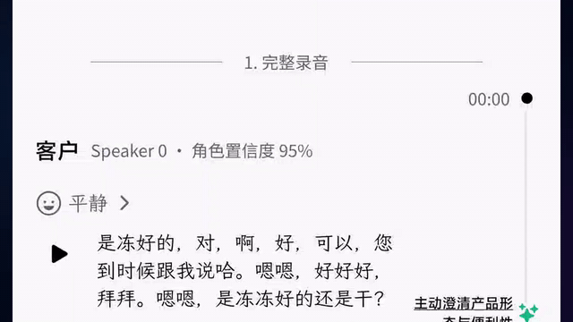
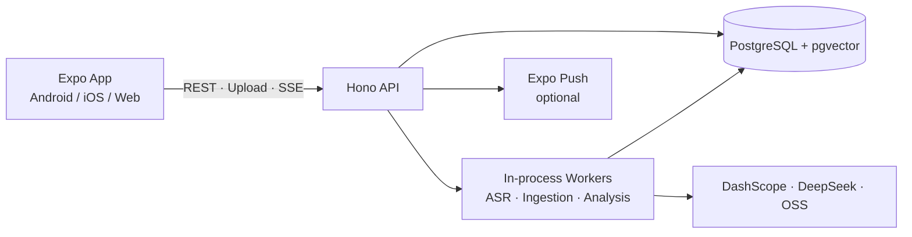

<div align="center">
  
  <h1>EchoWave</h1>
  <p>From raw conversations to reviewable, knowledge-grounded business insights.</p>

**English** | [简体中文](./README.zh-CN.md)

[](https://github.com/MetaBrain-Labs/EchoWave/releases)
[](https://github.com/MetaBrain-Labs/EchoWave/actions/workflows/ci.yml)
[](./LICENSE)


</div>

<p align="center">
  
</p>

**Open-source, self-hosted workspace connecting audio, business analysis, and team knowledge.** Audio → ASR → Speaker/emotion → Human review → Business analysis → Knowledge/RAG → Auditable result.

> [!WARNING]
> **Early preview:** EchoWave `v0.1.x` is intended for self-hosted or private deployments and is not yet suitable as a public multi-user service. It has no real accounts, authorization, or rate limits. See [Security](./SECURITY.md) and [Current limitations](#current-limitations) before deploying.

[Quick start](#quick-start) · [Use cases](#use-cases) · [Capabilities](#current-capabilities) · [Architecture](#how-it-works) · [Limitations](#current-limitations) · [Future](#future) · [Docs](./docs/README.md) · [Contributing](./CONTRIBUTING.md)

## Use cases

| Scenario                 | What EchoWave produces                                                                    |
| ------------------------ | ----------------------------------------------------------------------------------------- |
| Sales calls              | Transcript, speaker roles and emotion, plus strong / improvable / risky talk-track points |
| Customer & user research | Speaker separation, structured insights, and knowledge that stays in the workspace        |
| Team meetings            | A confirmable transcript, downstream analysis, and a searchable knowledge base            |
| Training and QA          | Conversation review, cited evidence, and traceable analysis of each finding               |

## Why EchoWave

EchoWave helps teams turn interviews, sales calls, meetings, and other recordings into structured, reviewable knowledge. It combines a bilingual Expo client, a self-hosted API, PostgreSQL/pgvector RAG, versioned transcription and confirmation, speaker/emotion analysis, business reports, and auditable AI execution records.

- **Audio to report**: ASR, speaker review, transcript confirmation, role/emotion recognition, and business analysis.
- **Reviewable and traceable results**: raw transcripts, confirmed versions, downstream analysis, retries, cancellation, recovery, and provider calls keep distinct audit facts.
- **Knowledge-grounded output**: ingest Markdown, DOCX, and XLSX files into pgvector and answer with validated citations.
- **Self-hosted control**: operators control the server, database, audio lifecycle, and credential boundary; the app connects to a runtime-selected server.
- **Cross-platform and bilingual**: one Expo codebase targets Android, iOS, and Web, with Simplified Chinese and English UI and analysis output.

## Current capabilities

| Area          | Available today                                                                                         |
| ------------- | ------------------------------------------------------------------------------------------------------- |
| Workspace     | Groups, knowledge bases, data sources, links, audio uploads, soft archive, and starter templates        |
| Audio         | DashScope file transcription, Silero VAD, speaker turns, transcript confirmation, retry/cancel/recovery |
| Analysis      | Speaker review, business roles, acoustic/text emotion, LangGraph sales review, custom focus areas       |
| Knowledge     | Markdown/DOCX/XLSX parsing, DashScope embeddings, pgvector retrieval, citation-checked answers          |
| Automation    | Immediate or scheduled batches, checkpoint recovery, SSE live status, optional Expo Push                |
| Configuration | Provider and credential revisions, capability bindings, task snapshots, redacted AI reports             |
| Client        | Android/iOS/Web, runtime server selection, onboarding, Chinese/English UI and analysis language         |

## How it works



Zod schemas in `packages/contracts` are the shared API/client boundary. PostgreSQL is the only authoritative business store. Redis currently has a configuration contract only and is not used for queues, caching, or business persistence. See the [architecture guide](./docs/architecture.md) for the full module and data-flow description (currently in Chinese).

## Quick start

### Prerequisites

- Source development: Node.js `24.x`, pnpm `11.3.0`, PostgreSQL `15+`, pgvector `0.8.0+`, and FFmpeg
- Self-hosted server: Docker Engine/Desktop with Compose
- Release app: an Android device; source builds additionally need Android tooling, and iOS development needs macOS with Xcode

The Server can run on Ubuntu 22.04 x86_64 or on Windows 10/11 with Docker Desktop using Linux containers. The [Server deployment guide](./docs/server-deployment.md) contains the verified Ubuntu source path, Windows PowerShell steps, HTTPS, backup, and uninstall instructions.

Choose an audio runtime mode during setup: all three modes support closing the App after the upload completes and the server task is successfully created/submitted; the Server then continues in the background. Lightweight local uses temporary local storage for the lowest cost but lowest recovery capability; default hybrid uses persistent local storage plus OSS staging for balanced cost and reliability; object storage uses persistent OSS storage for cloud deployment, large scale, and best recovery. Killing the App before upload completes does not mean the Server has taken over. A mode change affects only newly created assets. See [audio runtime modes](./docs/audio-runtime-modes.md).

### I want to use EchoWave

Download the latest signed Android APK and the matching `EchoWave-server-vX.Y.Z.zip` from [GitHub Releases](https://github.com/MetaBrain-Labs/EchoWave/releases), verify their SHA-256 checksums, and follow the bundled README. Releases are published through a `vMAJOR.MINOR.PATCH` tag; do not install from `main`.

```bash
unzip EchoWave-server-vX.Y.Z.zip -d echowave-server
cd echowave-server
cp api.env.example api.env
# Replace the database password, CREDENTIAL_MASTER_KEY, and CONFIGURATION_ADMIN_TOKEN
docker compose config
docker compose pull
docker compose up -d
curl http://localhost:3001/health
```

Then install the APK and enter the Server address. On a trusted LAN, a phone connects to `http://<SERVER_LAN_IP>:<API_PORT>`, never the server's `localhost`; a cloud or other public address must use the HTTPS reverse-proxy origin without the internal API port. See the [release guide](./docs/releases.md), [Server deployment guide](./docs/server-deployment.md), and [self-hosting guide](./docs/self-hosting.md).

### I want to develop EchoWave

```bash
git clone https://github.com/MetaBrain-Labs/EchoWave.git
cd EchoWave
pnpm install --frozen-lockfile
cp apps/api/.env.example apps/api/.env
cp apps/mobile/.env.example apps/mobile/.env
# Configure PostgreSQL and required security fields before continuing
pnpm --filter @echowave/api migrate
pnpm --filter @echowave/api seed:dev  # optional demo data
pnpm start
```

On a physical device, set the mobile environment to the development machine's LAN address:

```dotenv
EXPO_PUBLIC_API_URL=http://<SERVER_LAN_IP>:<API_PORT>
```

You can also run `pnpm dev:api` and `pnpm dev:mobile -- --lan` in separate terminals. Without a Development Build, `pnpm --filter @echowave/mobile dev:go -- --lan` can preview compatible features, but Expo Go cannot validate the complete remote-push flow.

After startup, open **More → AI Configuration** to create providers, select a Local Credential alias or securely store a Database Credential, and bind capabilities. EchoWave currently centers on Alibaba Cloud Model Studio/Qwen because one Alibaba Cloud account can cover embedding, ASR, multimodal, third-party DeepSeek model access, and OSS. Model Studio API keys and OSS AccessKeys remain separate credentials, and EchoWave still uses separate DashScope, DeepSeek, and OSS logical connections. Lightweight local does not need OSS; hybrid and object-storage modes do. Only the repository's adapted default models are guaranteed today, with more models and providers planned. See the [configuration and credential guide](./docs/configuration.md).

## Common commands

```bash
pnpm docs:check
pnpm lint
pnpm typecheck
pnpm test
pnpm build   # Builds API/contracts and exports Expo bundles; it does not create an APK
pnpm check   # Full repository verification gate
```

Android device regression is managed separately under `.maestro/`; see the [mobile E2E guide](./docs/mobile-e2e.md).

## Current limitations

- No real accounts, authentication, RBAC, rate limits, or public-internet production baseline; public testing requires HTTPS and tightly scoped network access.
- API and workers share one process; local audio paths and in-process SSE wakeups require a single API instance.
- No automatic data-source sync, PDF/OCR/legacy Office ingestion, re-transcription, cursor pagination, or Redis queue.
- No iOS Release, QR/mDNS discovery, in-app updater, or hosted cloud service.
- Native iOS and push validation require macOS/Xcode and Apple/APNs credentials.

Read the [security policy](./SECURITY.md) and [self-hosting guide](./docs/self-hosting.md) before deployment.

## Future

The roadmap follows one principle: make EchoWave a dependable self-hosted product before expanding the platform and ecosystem.

1. **Installability and onboarding**: maintain signed Android releases and Server rollback compatibility, then add better diagnostics, demos, and currently surfaced actions such as re-transcription.
2. **Production security**: real accounts and tenants, RBAC, HTTPS/reverse-proxy baseline, rate limits, backup/restore, and stronger security auditing.
3. **Scalable runtime**: separate API/workers, durable queues, multi-instance live events, object-storage-first audio lifecycle, and observability.
4. **Broader knowledge and audio support**: data-source connectors, PDF/OCR/legacy Office, pluggable ASR/LLM providers, stronger retrieval, and configurable analysis templates.
5. **Platform reach**: validated iOS releases, QR/mDNS discovery, improved Web delivery, and exploration of privacy-first offline capabilities.

Priorities may change with user feedback, maintainer capacity, and security risk; this is not a release-date commitment. See [ROADMAP.md](./ROADMAP.md) for outcomes and explicit non-goals.

## Contributing, security, and license

Read [CONTRIBUTING.md](./CONTRIBUTING.md) before opening a pull request. Use [GitHub Issues](https://github.com/MetaBrain-Labs/EchoWave/issues) for bugs and feature proposals. Do not disclose vulnerability details publicly; follow [SECURITY.md](./SECURITY.md).

`main` is protected, so every change lands through a pull request and the `CI` workflow must pass before merge. Maintainers keep the branch ruleset, CI requirement, and discussion channels enabled in the repository settings.

EchoWave is licensed under the [Apache License 2.0](./LICENSE). Contributions are submitted under the same license.
