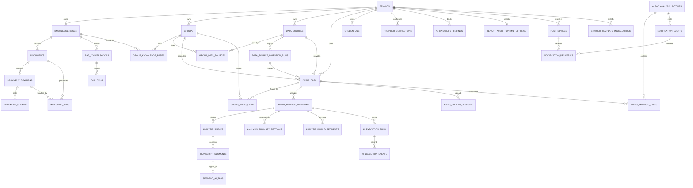

# EchoWave 数据库结构

[English](./database-schema.md) | **简体中文**

本文说明 EchoWave 应用全部 SQL migration 执行后的目标数据库结构。数据库结构的权威来源始终是 [`apps/api/migrations`](../apps/api/migrations/) 中按文件名排序、符合 `NNN_name.sql` 规则的编号 migration；本文用于解释各表的业务职责、关系、约束和生命周期，不记录某一开发环境的临时迁移状态。`sql.sql` 和 `trigger.sql` 属于历史快照，不进入迁移执行序列，也不作为本文事实来源。

## 数据库边界

EchoWave 使用 PostgreSQL 作为权威业务存储，并通过 pgvector 支持知识库向量检索。完整结构分为三部分：

- 应用业务 schema：55 张业务表，以及迁移入口创建的 `schema_migrations`。
- LangGraph 独立 schema：4 张 checkpoint 表，由 `PostgresSaver.setup()` 管理。
- `public` schema：安装 `vector` 扩展，为 `document_chunks.embedding` 提供 `vector(1024)` 类型和 HNSW 索引能力。

音频二进制、第三方连接凭据和页面 UI 偏好不进入这些业务表。数据库保存每条音频创建时固化的运行模式、存储后端/绑定 revision、定位键、SHA-256、源文件状态与清理期限；混合/轻量音频位于 API 受控目录，对象模式原音频位于企业 OSS。DashScope Instant 与 `audio_staging` 只保存短期中间文件。数据库保存权威业务事实；数量、总时长、最近上传时间和关联分组数量由查询聚合生成。

## 核心关系



## 租户与迁移管理

### `tenants`

租户是整个业务数据树的根实体。知识库、分组、数据源、音频及分析结果都通过 `tenant_id` 归属租户。

当前产品使用固定开发租户，但保留租户边界可以阻止不同组织的数据发生关联，也为后续接入真实账号和权限体系保留稳定的数据基础。

关键字段：

- `id`：租户 UUID 主键。
- `name`：租户名称。
- `created_at`：创建时间。

### `schema_migrations`

迁移记录表由 API 的显式迁移入口创建，不属于业务领域。每个 migration 在独立事务中执行成功后，才会把文件名和执行时间写入本表。

关键字段：

- `name`：migration 文件名，也是主键，例如 `001_rag.sql`。
- `applied_at`：成功提交时间。

迁移入口按照文件名排序，只执行尚未记录的 migration。业务 SQL 和迁移记录在同一事务中提交，从而避免只完成一半的迁移状态。

### `starter_template_installations`

记录租户已安装的起步模板目录版本。迁移入口在建立当前固定租户后，以 `(tenant_id, catalog_version)` 插入作为并发和重复运行门禁；版本标记、分组、数据源和关联在同一事务中提交。

当前目录版本为 `1`，安装“销售通话复盘”、“个人表达教练”和“快速录音上传”。安装成功后不再根据名称或内容回填，因此用户的改名、设置修改、解除关联和软归档都会保留。

## 租户 AI 配置

### `credentials` 与 `credential_versions`

`credentials` 保存租户内稳定的 Credential 身份与 Provider 类型，不保存明文。`credential_versions` 保存 AES-256-GCM 加密后的不可变 Secret 版本，包括 12 字节 IV、16 字节认证标签、密钥版本和掩码信息。API 只返回配置状态与末四位，不返回密文或明文。

### `provider_connections` 与 `provider_connection_revisions`

连接主表保存名称、Provider 类型、活动 revision 指针和软删除状态。每个 revision 固化普通配置及 `database` 或 `local_file` Credential 来源；Database 来源必须关联同租户 Credential version，Local 来源保存 alias/type，二者不能混用。新 revision 发布后只影响新请求，已排队任务继续使用创建时快照。

### `ai_capability_bindings` 与 `ai_capability_binding_revisions`

能力绑定把 embedding、知识问答、ASR、音频暂存、声学情绪、角色识别、业务分析和原音频对象存储映射到具体 Provider revision。绑定 revision 保存主连接、可选辅助连接、模型和设置快照；文档入库、RAG、音频转写、后处理和业务分析任务均保存实际使用的绑定 revision 外键。

### `configuration_imports`

记录租户从旧 `apps/api/.env` 导入供应商配置的幂等事实。目前来源固定为 `legacy_env`；成功导入后数据库配置优先，历史环境变量只保留升级过渡用途。

## 知识库与 RAG

### `knowledge_bases`

知识库主表，对应用户看到的一个知识集合。它保存知识库名称、描述、当前只读处理配置和生命周期信息，不保存文档数、文件总大小或关联分组数。

当前配置字段：

- `storage_location`：内容存储位置，当前默认 `local`，可选 `local` 或 `cloud`。
- `indexing_mode`：索引方式，当前默认 `rag`，可选 `full_context` 或 `rag`。
- `embedding_model`：知识库配置的嵌入模型，当前固定为 `qwen3.7-text-embedding`。
- `reranker_model`：可为空的重排序模型；`NULL` 表示未启用。
- `parsing_mode`：解析方式，当前默认 `automatic`，可选 `automatic` 或 `manual`。

这些字段当前用于保存和展示创建时配置，不改变仍由 API 全局配置驱动的解析与检索流程。

关键约束与行为：

- `deleted_at` 用于软删除。
- `(tenant_id, updated_at DESC)` 部分索引支持租户内未删除知识库列表。
- `(tenant_id, id)` 唯一约束供音频工作区的租户复合外键使用。
- `documentCount` 从未删除的 `documents` 聚合。
- `linkedGroupCount` 从 `group_knowledge_bases` 与未归档 `groups` 聚合；归档分组的关系事实仍保留但不计入页面数量。
- `totalSizeBytes`、`parsedDocumentCount`、`pendingDocumentCount` 和 `lastUploadedAt` 从未删除 `documents` 聚合，不回写主表。

### `documents`

知识库中的逻辑文档。一条记录表示用户看到的一个文件，而不是某一次解析结果。重新上传、重新解析或更换 embedding 配置时，逻辑文档保持不变并产生新的 `document_revisions`。

主要内容：

- `knowledge_base_id`：所属知识库。
- `title`、`format`、`size_bytes`：文件元数据。
- `status`、`progress`：入库生命周期和进度。
- `error_code`、`error_message`、`error_retryable`：结构化失败信息。
- `active_revision_id`：当前正式发布的文档修订版。
- `deleted_at`：软删除时间。

`format` 当前限制为 `markdown`、`word` 或 `spreadsheet`；`status` 覆盖排队、校验、解析、切块、向量化、完成、失败和删除过程。

### `document_revisions`

文档一次完整解析和向量化的不可变修订版。新版本处理失败时，`documents.active_revision_id` 不会切换，旧版本仍可继续参与检索。

主要内容：

- `source_sha256`：原文件内容哈希，用于识别重复输入。
- `parser_version`：解析器版本。
- `embedding_model`、`embedding_dimensions`、`embedding_provider`：向量配置。
- `embedding_tokens`、`embedding_cost_amount`、`embedding_cost_currency`：用量及带币种成本；迁移前的 USD 数值保留不变。
- `preview_text`、`warnings`：预览和结构化警告。
- `status`、`published_at`：处理和发布状态。

同一租户、文档和来源哈希只能对应一个修订版。当前向量维度固定为 1024。

### `document_chunks`

文档修订版切分出的最小可检索证据单元，是 RAG 向量检索的核心事实表。

主要内容：

- `chunk_index`：修订版内片段顺序。
- `title`、`heading_path`：标题及层级路径。
- `content`、`embedding_text`：原始内容和用于生成向量的文本。
- `content_sha256`：片段内容哈希。
- `locator`：原文定位信息。
- `embedding_model`、`embedding`：模型名称和 1024 维向量。

同一修订版内 `chunk_index` 唯一。HNSW 余弦距离索引用于快速查找与问题最相关的片段；删除修订版时，其 chunks 物理级联删除。

### `ingestion_jobs`

知识文档入库任务表，记录从文件校验、解析、切块到向量化发布的处理过程。

主要内容：

- `document_id`、`revision_id`：本次任务处理的逻辑文档和修订版。
- `stage`、`status`：当前阶段和任务状态。
- `attempts`、`lease_until`：重试次数和 worker 租约。
- `staged_path`：临时文件位置。
- 结构化错误字段。

领取索引配合 `FOR UPDATE SKIP LOCKED` 和租约机制，允许 worker 安全领取待处理任务并恢复过期任务。迁移 019 在知识入库、音频转写、音频后处理和业务分析任务表上增加提交后通知触发器；通知只包含 schema、租户和队列名，用于低延迟唤醒，不创建第二套队列表，也不改变任务状态的权威来源。

### `rag_conversations`

知识库问答会话表，把业务会话与 LangGraph `thread_id` 关联起来。一个会话固定属于一个租户和一个知识库，并通过 `expires_at` 限制生命周期。

它只记录业务会话边界，不直接保存 LangGraph 的内部状态快照。

### `rag_runs`

每一次可信知识问答执行的审计记录。

主要内容：

- `question`、`answer`：问题和最终回答。
- `grounded`：回答是否具有知识库证据。
- `cited_chunk_ids`：最终引用的文档块。
- embedding、输入和输出 token 数量。
- embedding 与聊天模型、供应商。
- `duration_ms`、`status`、`completed_at`：耗时和运行结果。

会话被物理删除时，其运行记录级联删除。这张表用于历史展示、成本统计、质量分析和故障审计。

## 分组与关联

### `groups`

租户内组织知识库、数据源和音频的工作空间，对应移动端“分组”页面。

`starter_template_key` 为可空的稳定模板身份，当前只用于起步分组的标识与首次引导；租户内非空值唯一。改名或修改分析设置不改变该身份，归档后也不会释放标识用于重建。

表中只保存名称、租户、创建更新时间和软删除时间。分析数、音频数、知识库数和数据源数均通过事实表聚合，不保存为可写计数字段。

### `group_knowledge_bases`

分组与知识库的多对多关联表。一条记录表示一个分组可以使用一个知识库。

- `(tenant_id, group_id, knowledge_base_id)` 联合主键防止重复关联。
- 两侧都使用租户复合外键，阻止跨租户关联。
- 反向索引支持统计知识库的 `linkedGroupCount`。
- 解除关联直接删除关联记录，不删除分组或知识库。

### `group_data_sources`

分组与数据源的多对多关联表。分组关联活动数据源后，该数据源下的所有未删除音频对分组可见，不需要逐条复制音频关联。数据源归档后关系记录仍保留，但不再提供音频可见性，也不再计入分组的数据源数量。

联合主键防止重复关联，反向索引支持查询一个数据源关联了哪些分组。解除关联不会删除数据源和音频，也不会影响 `group_audio_links` 中仍然存在的显式分享。

### `group_audio_links`

分组与音频之间的显式关联表，仅用于直接上传到分组的音频和跨分组显式分享。

分组可见音频由以下两个事实集合合并去重：

```text
group_audio_links 中的显式关联音频
UNION
group_data_sources 所关联数据源下的音频
```

联合主键保证同一音频不会被重复显式关联到同一分组。删除关联只撤销可见关系；物理删除分组或音频时，关联记录级联清理。

## 数据源与导入记录

### `data_sources`

描述音频从哪里进入系统，以及进入后采用哪些分析设置。`starter_template_key` 为可空、租户内唯一的起步资源身份；当前 `starter_audio_upload` 表示与两个模板分组共享的手动上传数据源。

接入信息：

- `source_type`：`manual_upload`、`http_api`、`cloud_drive`、`s3` 或 `local_folder`。
- `location`：`local` 或 `cloud`。
- `connection_label`：面向用户展示的连接说明。
- `connection_status`：`connected`、`disconnected`、`error` 或 `disabled`。

分析设置：

- `transcription_model`：数据源后续转写的默认模型；迁移 011 后为 `qwen-audio-3.0-asr-flash-filetrans`。
- `auto_transcribe`：是否自动转写。
- `emotion_analysis_enabled`：是否启用情绪分析。
- `speaker_diarization_enabled`：是否启用说话人分离。
- `scene_segmentation_enabled`：是否启用场景分段。
- `skip_invalid_audio`：是否跳过无效音频。
- `custom_business_roles`：供角色识别使用的自定义角色 JSON 字符串数组，最多 16 项；核心角色不存入该字段。

数据源使用 `deleted_at` 软删除。API Key、密码、Authorization Header 等第三方凭据禁止写入本表。

页面指标全部动态计算：

- 音频数量和总时长来自 `audio_files`。
- 已完成数量来自音频当前有效的 ready 分析版本。
- 最近上传时间来自成功或部分成功的 `data_source_ingestion_runs`。
- 关联分组数来自 `group_data_sources`。

### `data_source_ingestion_runs`

一次数据源手动上传或同步操作的运行记录。

主要内容：

- `trigger_kind`：`manual` 或 `sync`。
- `status`：`running`、`succeeded`、`partial` 或 `failed`。
- `started_at`、`completed_at`：运行时间线。
- 结构化错误字段。

每次运行导入的音频数量和总时长通过其关联的 `audio_files` 聚合。页面上传时间线会把本表的完成记录与转写失败的分析修订版合并展示。

## 音频运行与上传

### `tenant_audio_runtime_settings`

每个租户保存一条当前音频运行策略，模式为 `hybrid`、`object_storage` 或 `lightweight_local`。记录递增 revision、原音频保留天数、中间文件保留小时数及更新时间。切换只影响之后创建的资产；`audio_files` 会固化创建时模式、存储后端、绑定 revision、源文件校验值和清理期限。

## 音频

### `audio_files`

租户内音频的唯一权威记录。一段音频无论被多少分组访问，都只保存一份元数据。

来源关系：

- `data_source_id`：提供音频的数据源，可为空。
- `ingestion_run_id`：产生音频的导入运行，可为空。
- `origin_group_id`：最初上传音频的分组，可为空，用于展示来源而不是控制可见性。

文件元数据：

- `title`、`original_filename`、`mime_type`。
- `size_bytes`、`duration_ms`，均使用数值而不是展示字符串。
- `storage_key`：可为空的对象存储定位键。
- `source_external_id`：第三方数据源中的外部标识。

处理状态：

- `upload_status`：`uploading`、`ready`、`failed` 或 `deleting`。
- `upload_progress`：0 到 100。
- 上传失败的结构化错误字段。
- `active_analysis_revision_id`：当前已发布分析修订版。

同一租户和数据源内，非空的 `source_external_id` 唯一，支持第三方同步幂等。复合外键保证导入运行属于同一个数据源，当前分析修订版属于同一条音频。

表中不保存音频二进制，只保存相对定位键和元数据；`deleted_at` 用于软删除。当前手动上传实现把二进制写入 `AUDIO_STORAGE_DIR`，归档音频只隐藏业务记录，不物理删除本地文件。

播放接口按当前租户和 `deleted_at IS NULL` 查询记录，并要求 `upload_status = 'ready'` 与非空 `storage_key`。HTTP Range、播放进度和当前播放片段都是传输层或页面内存状态，不写入数据库。

### `audio_upload_sessions`

保存对象直传或 API 二进制上传的短生命周期会话。每条会话冻结租户、数据源、运行模式、上传策略、文件名/MIME、大小和过期时间，可关联最终 `audio_file_id` 与批次 `analysis_task_id`。状态覆盖创建、上传、完成、失败和过期；完成接口必须保持幂等，且单文件仍受 200 MiB 上限约束。

## 音频分析结果

### `audio_analysis_revisions`

一段音频的一次完整转写和分析版本。重跑任务新增 revision，不覆盖已有结果。

主要内容：

- `revision_no`：音频内递增版本号。
- `transcription_model`、`analysis_model`：本次请求实际选择并在任务开始时固化的模型，不受后续默认配置变化影响。
- `settings_snapshot`：对象类型的设置快照，记录预处理方式、固定识别语言、该模型声明的 diarization/时间戳能力，以及发布时实际是否收到 Speaker 和实际响应粒度；角色与情绪能力为 false。历史修订缺少新增实际能力字段时由读取层兼容推导。
- `status`：`queued`、`transcribing`、`analyzing`、`ready` 或 `failed`。
- `progress`：0 到 100。
- `processing_stage`：进行中修订的 `queued`、`preprocessing`、`transcribing`、`awaiting_result`、`validating` 或 `publishing` 阶段；`correcting`、`splitting`、`merging` 仅兼容历史修订。`awaiting_result` 表示异步任务已提交，正在由 Polling 或 EventBridge 发现终态。Qwen Filetrans 仍接收一个流式生成的整段压缩音频，长音频业务分析另行按窗口保存 checkpoint。
- `transcription_provider`：本次修订使用的供应商；迁移 011 后新修订固定为 `dashscope`，旧值仅作为历史审计记录保留。`settings_snapshot.preprocessingManifest` 在 `silero_vad` 模式下保存固定模型校验值、策略、原始/压缩时长、保留区间、跳过区间和时间轴映射，并与临时 OSS 对象键一同写入以支持重启恢复。
- `provider_task_id`、`provider_submitted_at`：DashScope 异步任务标识和首次提交时间，用于进程重启后恢复终态发现及六小时超时判断。
- `provider_terminal_source`、`provider_terminal_event_id`、`provider_terminal_status`、`provider_terminal_received_at`：Polling 或 EventBridge 首次接受的供应商终态事实。EventBridge 保存事件 ID；同一任务后续重复或冲突事件不覆盖首个事实。
- `provider_terminal_result_url`：成功终态携带的 HTTPS 短期结果地址，仅保留到结果发布或失败收敛，之后清空。`provider_terminal_error_code`、`provider_terminal_error_message` 保存受限长度的失败摘要。
- `provider_poll_attempt`、`provider_last_polled_at`、`provider_next_poll_at`：Polling 的持久化调度状态；每次只查询一次，按 2/5/10/15 秒递增间隔设置下一次截止时间。EventBridge 模式不设置或领取该时间。
- `provider_artifact_key`：仍需清理的临时 OSS 对象键；删除成功后清空，任务 ID 保留用于审计。
- `current_chunk`、`chunk_count`：当前 Chunk 和总数，必须成对满足 `1 <= current_chunk <= chunk_count`。
- `current_chunk_start_ms`、`current_chunk_end_ms`：当前逻辑分块在完整录音中的毫秒范围。
- `network_attempt`：当前网络尝试，范围为 1 到 3；`structure_attempt` 仅兼容旧修订，新 STT 任务保持空值。
- `processing_updated_at`：最近一次可观察活动更新时间。
- `error_stage`：失败发生在 `transcription`、`analysis` 或 `publish`。
- `error_details`：可空 JSON 对象，只保存安全失败分类、分块位置、最多 20 条稳定校验问题，以及兼容旧修订的结构尝试/输出指纹字段；新 STT 任务不保存模型正文或输出指纹。
- `active_transcript_confirmation_id`：当前 Confirmed Transcript 指针；新 ASR revision 发布后为空，用户首次确认后才设置。
- 结构化错误摘要、创建、完成和发布时间。

同一音频的 `revision_no` 唯一，部分唯一索引同时只允许一个 `queued`、`transcribing` 或 `analyzing` 修订。新版本只有在本次结构化结果完整写入后，才在同一事务中替换 `audio_files.active_analysis_revision_id`；ASR-only 版本允许摘要与标签为空，失败版本不会覆盖旧的有效版本。

音频转写 revision 的 `settings_snapshot.preprocessingMode` 对新任务记录 `silero_vad` 或 `whole_file`，历史 `ffmpeg`、`direct` 值仅保留审计；`segmentationMode` 记录 `readable` 或 `speaker_turn`。成功发布补充 `speakerIdentityScope`：整文件 Qwen 为 `recording`，无法保证跨块身份时为 `chunk`，无说话人身份时为 `none`。历史修订缺失字段时按 `whole_file + readable + none` 读取。

Qwen Filetrans 提交单个 16kHz 单声道整文件；其带 `speaker_id` 的句子按说话人变化、1500ms 停顿和 240 字软上限转换为独立 `transcript_segments`。缺失 Speaker 或时间戳异常的结果不发布。

活动字段只在进行中修订上作为客户端可观察状态存在：queued 初始化阶段但没有 Chunk，worker 领取后进入预处理，供应商任务提交后进入 `awaiting_result`；Chunk 字段必须全部为空或全部存在，时间范围必须递增，尝试次数必须关联当前 Chunk。中断恢复只重新排队未提交任务，已有 task ID 的任务按当前通知模式继续发现终态，已持久化终态的任务直接进入统一完成阶段；成功或失败会清空活动字段和短期结果 URL。

物理删除音频时，修订版及其结构化结果级联删除。

### `transcript_confirmations`

用户对一个 ASR revision 的不可变确认版本。`version_no` 在同一 revision 内递增，`confirmed_at` 记录确认时间；`audio_analysis_revisions.active_transcript_confirmation_id` 只指向当前版本。历史 ready revision 在迁移时以原始正文回填为 v1。

### `transcript_confirmation_segments`

一个确认版本对全部 Raw 片段的完整正文快照。每行通过复合外键同时关联确认版本和原始 `transcript_segment_id`，正文不能为空；确认事务必须完整覆盖当前 revision 的片段集合。Raw 与每个 Confirmed 版本可直接联表计算修正差异，当前里程碑不提供统计或导出接口。

### `audio_speaker_review_jobs`

每个 ASR revision 至多保存一个 Speaker Review 任务，固化能力绑定 revision、模型、状态和脱敏错误。状态为 `queued`、`running`、`ready` 或 `failed`；Worker 通过 PostgreSQL 通知低延迟唤醒，并继续使用 `FOR UPDATE SKIP LOCKED` 领取。

### `speaker_review_findings`

保存规则或模型发现的疑似说话人切换边界。Finding 可以绑定具体 Raw Transcript 片段与 word index，也可以描述整段录音问题；严重程度、原因代码和短说明受约束。迁移 023 增加解决时间与解决来源，用户可逐条或全部解决，但不会改写 Raw Transcript。

### `audio_post_analysis_jobs`

ASR 确认后的情绪分析和角色识别任务。每条任务固化 `analysis_revision_id`、`transcript_confirmation_id`、`type`、`model` 与 `custom_business_roles_snapshot`，状态为 `queued`、`running`、`ready` 或 `failed`，并保存进度、完成时间和脱敏错误。worker 从固化的 Confirmed Transcript 读取正文；后续再次确认不会改变运行中或已发布任务的输入。部分唯一索引阻止同一 revision、同一类型同时存在多个运行任务，但允许情绪与角色任务并行。

任务由对应 worker 使用 `FOR UPDATE SKIP LOCKED` 领取。进程重启时中断任务重新排队；失败只更新当前任务，不修改 revision 的 active 结果指针。

### `audio_post_analysis_windows`

长 Confirmed Transcript 的情绪或角色分析按窗口保存幂等 checkpoint。复合主键为租户、job 和 `window_index`；每个窗口保存时间范围、片段集合、状态、尝试次数、结构化结果和错误。已完成窗口在恢复时不会再次调用模型，父 job 删除时级联删除。

### `segment_emotion_results`

情绪任务的逐转写片段结果，以任务和 `segment_id` 唯一。保存固定主情绪、置信度、态度、唤醒度、语速、音量趋势、音高变化、停顿模式、最多 5 条声音线索及实际模型。写入完整任务结果后，事务最后更新 `audio_analysis_revisions.active_emotion_job_id`。

### `speaker_role_results`

角色任务的录音级说话人结果，以任务和 `speaker_key` 唯一。保存核心或自定义角色类型、展示名称、置信度、最多 3 个证据片段 ID 及实际模型。读取时同一个 `speakerKey` 的结果应用到该说话人的所有转写片段；写入完成后，事务最后更新 `audio_analysis_revisions.active_role_job_id`。

`active_emotion_job_id` 与 `active_role_job_id` 都属于 ASR revision，因此重转写产生的新 revision 不会泄漏旧 revision 的后处理结果。

### `group_analysis_settings`

分组级销售复盘设置，保存自动或手动时机、内容关注点、语气和最多 12 个自定义标签。任务创建时会把当时设置固化到 job，后续修改不改变已排队或历史结果。

### `audio_business_analysis_jobs`

分组、音频和已确认转写版本的销售复盘任务。每条任务固化 ASR revision、Confirmed Transcript、分组设置、知识库白名单、可选情绪/角色 job 与输入指纹；状态为 `queued`、`running`、`ready` 或 `failed`，并保存单调进度和脱敏错误。

`workflow_version` 绑定恢复语义，首版为 `langgraph-v1`；`recovery_attempts` 只记录可重试错误后已安排的恢复，进程中断不消耗该预算；`next_attempt_at` 持久化 15 秒和 60 秒退避截止点，claim 只领取已到期任务。`checkpoint_cleanup_pending` 表示业务已终态但 LangGraph thread 仍需补偿删除。

迁移 030 为业务分析和后处理 job 增加 `cancel_requested`。取消已提交外部调用时只标记请求，等待当前调用收敛后停止后续步骤；领取索引排除已请求取消的 job。

### `audio_business_analysis_windows`

长转写销售复盘的窗口级 checkpoint。结构与后处理窗口一致，以租户、job 和窗口序号保证幂等；最终汇总只消费已完成窗口结果。它补充 LangGraph 节点级 checkpoint，不替代最终业务表。

### `audio_group_business_analysis_heads`

每个分组和音频只保存一个当前已发布 job 指针，历史 job 及其结果继续保留。摘要、标签、片段证据、知识引用、job 终态和 head 移动在同一发布事务中完成；同 job 已是 `ready` 且仍为 head 时重复发布是幂等成功。

### `business_analysis_summary_sections` 与结构化标签表

`business_analysis_summary_sections` 保存有序复盘摘要；`business_analysis_tags` 保存优点、改进、风险、建议或自定义标签及置信度；`business_analysis_tag_segments` 关联 Confirmed Transcript 对应的原始片段 ID；`business_analysis_citations` 仅允许保存本次检索白名单中的 chunk 与文档定位。

## 批次自动化与推送

### `audio_analysis_batches`

一次“新建”操作形成一个租户级批次，固定数据源、分组、来源类型、可选执行时间、流水线快照和配置快照。取消时间属于批次事实；页面展示的总体状态和计数由任务聚合，不在批次中重复保存。

### `audio_analysis_tasks`

批次内每个上传项或已有音频对应一个任务。状态覆盖 `awaiting_upload`、`scheduled`、`queued`、`running`、`hard_blocked`、成功、带警告成功、失败和取消；阶段覆盖上传、转写、后处理、业务分析和完成。任务保存各阶段 job 指针、单调进度、阻塞/错误摘要、源文件过期时间和 `cancel_requested`，但不复制模型正文。

`stage_sources` 是内部 JSON 对象，为 `transcription / emotion / role / businessAnalysis` 保存 `created / reused / skipped / unavailable` 来源。新任务在选择已有引用或创建新 job 时逐阶段合并写入；旧任务默认空对象，诊断清单按 `unknown` 展示缺失字段，避免猜测历史执行方式。

同一批次通过 `audio_file_id` 或 `client_item_id` 幂等，计划时间和 `run_after` 决定领取资格。任务表及其外键是状态唯一来源；PostgreSQL `LISTEN/NOTIFY` 只负责唤醒，不替代 `FOR UPDATE SKIP LOCKED` 领取与补偿扫描。

### `audio_analysis_batch_blockers`

保存批次内按能力归并的活动硬阻塞，包括额度耗尽、凭据失效和配置缺失。绑定 revision 可为空；部分唯一索引保证同一批次、能力和原因只有一个活动阻塞。恢复后设置 `active=false` 与 `resolved_at`，不删除历史。

### `push_devices`

按租户登记 Expo Push Token 和 iOS/Android 平台，以 Token 唯一。`enabled` 控制后续投递，`last_seen_at` 支持重复注册刷新；`DeviceNotRegistered` 会停用设备而不是删除审计事实。

### `notification_events`

保存批次/任务产生的 `HARD_BLOCKED`、`FAILED`、`COMPLETED` 或 `PARTIAL_COMPLETED` 通知事实。`dedupe_key` 在租户内唯一，保证业务重试不会重复创建同一事件；通知数据只用于引导客户端重新读取权威批次状态。

### `notification_deliveries`

事件与启用设备的逐设备 outbox。状态覆盖等待、已取得 ticket、已送达、重试和失败；保存最多十次尝试、下次执行时间、Expo ticket、receipt 截止时间及脱敏错误。租户、事件和设备唯一，发送 Worker 只领取到期的非终态记录。

## 分析结构化结果与审计

### `analysis_scenes`

分析修订版中的有序场景或章节，例如“开场”“需求讨论”“后续安排”。

每个场景保存 `scene_index`、标题和起始毫秒位置。同一修订版内场景顺序唯一，起始时间不能为负数。

### `transcript_segments`

场景中的有序转写片段，是分析结果最细粒度的文本单元。

主要内容：

- `segment_index`：场景内顺序。
- `speaker_key`、`speaker_label`：说话人内部标识和展示名称。
- `business_role`：STT 修订固定为 `unknown`，后续文本分析可在独立流程中补充。
- `emotion`：STT 修订固定为 `unknown`，不根据转写正文猜测。
- `start_ms`、`end_ms`：音频时间区间。
- `text`：供应商原始转写正文，即不可变 Raw Transcript；人工修正只写入确认快照表。

数据库保证 `0 <= start_ms < end_ms`，并通过复合外键保证片段和场景属于同一租户、同一分析修订版。时间轴索引支持按场景和播放顺序恢复内容。

### `analysis_invalid_segments`

记录某个分析版本识别出的静音、噪声或其他无需参与分析的时间区间。

每条记录包含开始时间、结束时间和原因；时间区间必须有效，同一修订版内相同区间不能重复。这张表只描述分析判断，不修改原始音频。

### `analysis_summary_sections`

分析版本的有序摘要章节。每条记录保存 `section_index`、标题和正文，同一修订版内章节顺序唯一。

摘要拆成独立章节，便于客户端有序展示，也避免把整篇摘要保存成一个不可拆分的大字段。

### `segment_ai_tags`

附着在转写片段上的 AI 标签。当前版本限制每个转写片段至多一个标签。

主要内容：

- `title`：标签标题。
- `summary`：简要总结。
- `details`：JSON 字符串数组形式的详细要点。

`details` 必须是数组且数组元素全部为字符串。复合外键保证标签、转写片段和分析修订版属于同一租户与同一版本。

### `ai_execution_runs`

当前音频分析修订关联的一次安全 AI 运行。运行类型只允许 ASR 转写、情绪分析、角色识别和分组业务分析；业务分析额外保存 `group_id`，后处理和业务任务可通过 `source_job_id` 关联原任务。ASR 的提交与终态完成阶段分别形成运行记录，并通过 `phase` 区分。

运行保存 `running`、`completed`、`failed` 或 `interrupted` 状态、起止时间、耗时和紧凑错误摘要。进程启动时会把遗留的 `running` 记录收敛为可重试的中断终态；重新执行产生新记录，不覆盖历史。运行通过复合外键绑定音频与分析修订，物理删除修订时级联清理。

### `ai_execution_events`

一次运行内按 `sequence_no` 排序的安全事件，只允许 `step`、`model_call` 和 `tool_call`：

- 步骤保存稳定名称、状态、耗时和原始值类型受限的摘要字段。
- 模型调用保存 provider、model、尝试次数、Token、耗时和可选费用。
- 知识工具保存查询、执行时知识库名称快照、命中数、文档标题和块定位。

`details` 必须是 JSON 对象。产品审计明确不保存模型输入、模型输出、隐藏 reasoning、知识块正文、音频、OSS 地址、签名或凭据；本地 Markdown 诊断报告也不会通过这些表或客户端 API 暴露。

## LangGraph checkpoint 表

以下表由 `PostgresSaver.setup()` 在独立 LangGraph schema 中创建，不属于 EchoWave 业务模型，业务代码不应直接修改。

### `checkpoint_migrations`

记录 LangGraph checkpoint 内部表结构版本，与应用业务 schema 中的 `schema_migrations` 相互独立。

### `checkpoints`

保存某个 `thread_id` 和 namespace 下的 Graph 状态快照，包括 checkpoint 内容、元数据以及父 checkpoint ID，用于恢复 Agent 工作流。

### `checkpoint_blobs`

保存 checkpoint 各 channel 和 version 对应的二进制状态，避免把所有大对象重复内嵌在 checkpoint JSON 中。

### `checkpoint_writes`

保存某个 checkpoint 中各任务对 channel 的中间写入，支持工作流暂停、恢复和并行节点执行。

分组业务分析使用 `echowave:business-analysis:<workflowVersion>:<jobId>` 作为稳定 thread ID。checkpoint 只用于非终态恢复，可能短期包含已确认转写、检索查询和知识块副本；成功或最终失败后删除，删除失败由 `audio_business_analysis_jobs.checkpoint_cleanup_pending` 在 API 启动时重试。长期历史与审计仍以业务表和 `ai_execution_*` 为准。

## 数据生命周期与约束原则

### 租户隔离

- 顶层业务实体全部包含 `tenant_id`。
- 新增工作区关系使用 `(tenant_id, id)` 复合外键。
- 分组、知识库、数据源、音频及分析结果不能跨租户关联。
- 客户端不提交 `tenant_id`，当前租户由 API 配置注入。

### 删除策略

- `knowledge_bases`、`documents`、`groups`、`data_sources`、`audio_files` 使用 `deleted_at` 软删除。
- `group_knowledge_bases`、`group_data_sources`、`group_audio_links` 解除关系时物理删除。
- 文档块和分析结构化结果只在物理清理父修订版时级联删除。
- 删除分析修订版前必须确保它不再被 `active_analysis_revision_id` 引用。

### 修订版发布

文档和音频采用相同的发布模型：

```text
逻辑实体
├─ 多个不可变 revision
└─ active_revision_id → 当前已验证并发布的 revision
```

新 revision 的全部处理结果成功落库后才切换 active 指针。解析、转写、分析或发布失败只更新新 revision 的状态，不使旧内容离线。

### 动态聚合

以下页面数据不是可写字段：

- 分组的音频数、分析数、知识库数和数据源数。
- 知识库的文档数和关联分组数。
- 数据源的音频数、已完成数、待处理数和总时长。
- 最近上传时间和上传批次统计。
- 音频“来自某分组”和统一处理状态文案。

这些值通过 `COUNT(DISTINCT ...)`、`SUM(duration_ms)`、关联查询以及上传/分析状态组合得到，避免计数字段与事实数据失去同步。
